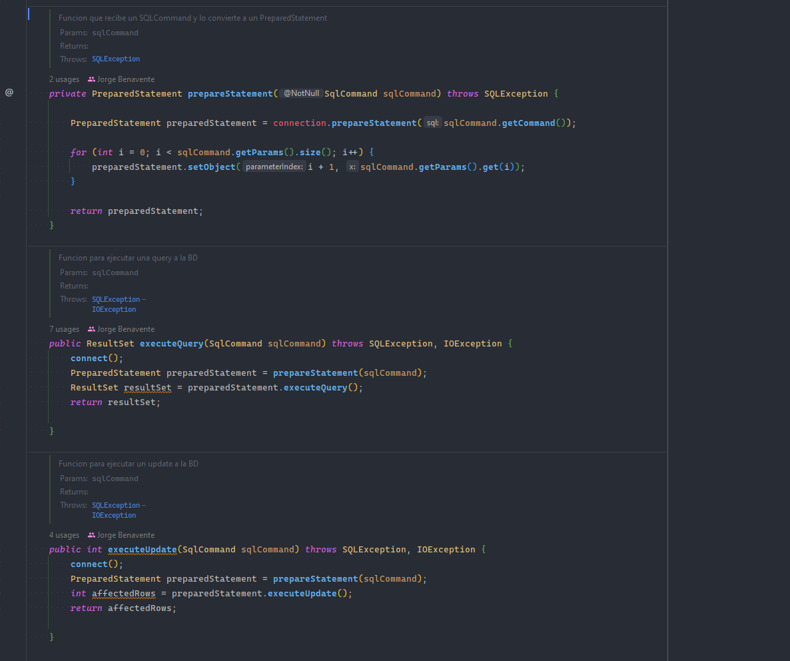
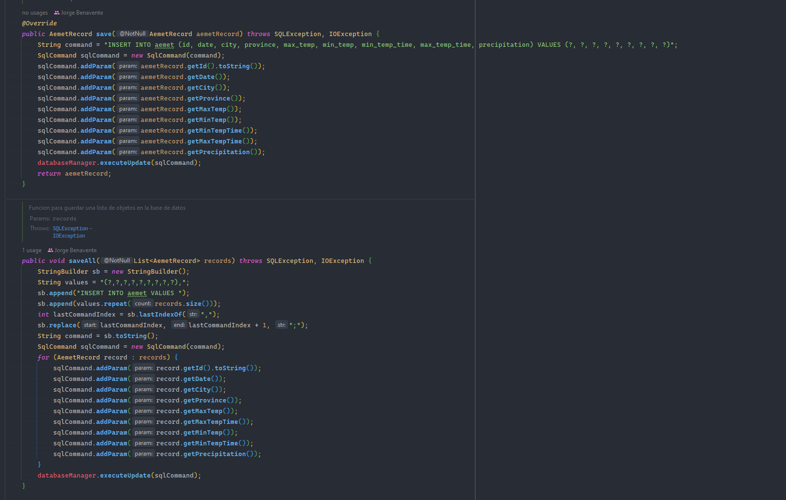
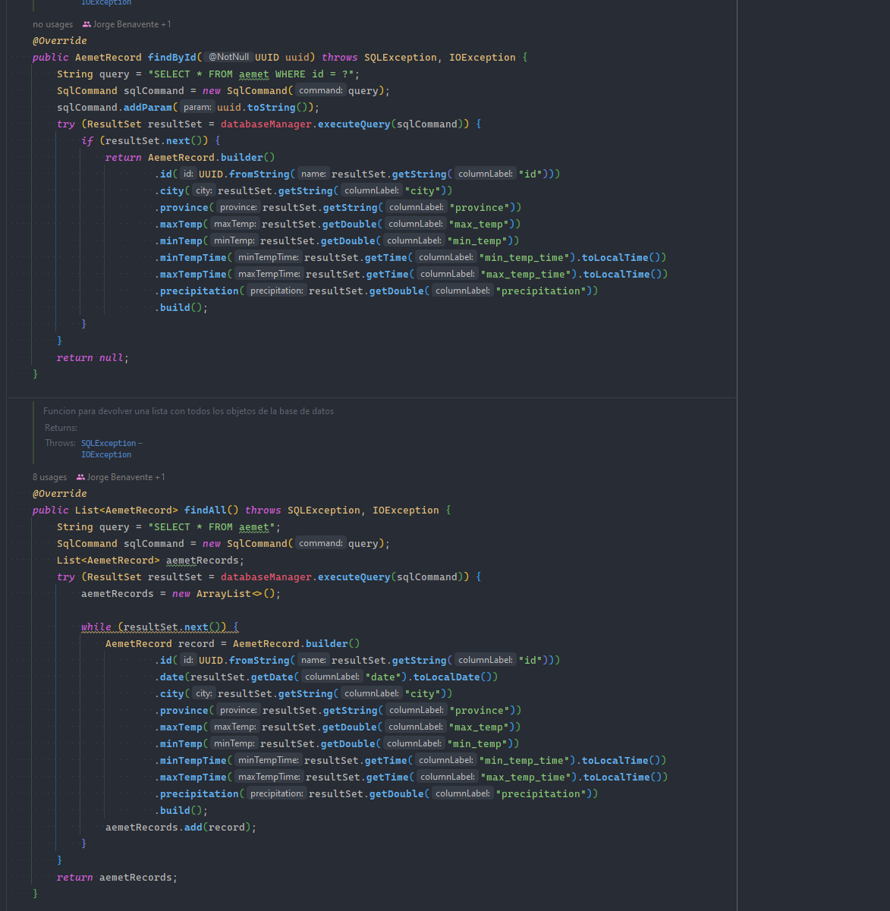
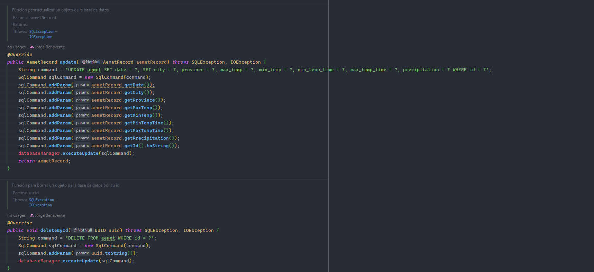

# PRÁCTICA 01 - AEMET

## Autores

- David Jaraba Pascual
- Jorge Benavente Liétor

## Requisitos

- Java 17 o superior
- Gradle (si quieres compilar el proyecto)
- Ficheros de datos de AEMET en la carpeta `data` con formato de nombre `AemetYYYYmmDD.csv`

## Arquitectura seguida en el código

En este proyecto se ha seguido una arquitectura de capas con el objetivo de separar las distintas responsabilidades de
la aplicación. En concreto, se ha seguido una arquitectura de 3 capas: capa de datos (en los
paquete `dev.database`, `dev.repository` y `dev.database.models`),
capa de lógica de negocio (en el paquete `dev.services`) y capa de presentación (`dev.controllers`).

En la clase [DatabaseManager](src/main/java/dev/database/DatabaseManager.java) tenemos 3 métodos importantes:

- `prepareStatement`: Se encarga de preparar una sentencia SQL para ser ejecutada.
- `executeQuery`: Se encarga de ejecutar una sentencia SQL que devuelve un conjunto de resultados.
- `executeUpdate`: Se encarga de ejecutar una sentencia SQL que no devuelve un conjunto de resultados.

Después tendríamos la clase [AemetRepository](src/main/java/dev/repository/AemetRepository.java) que se encarga de
generar las consultas a la base de datos para obtener la información requerida. Para ello utiliza los siguientes
métodos:

- `save`: Recibe un objeto de tipo [AemetRecord](src/main/java/dev/database/models/AemetRecord.java) y lo guarda en la
  base de datos. Este método es una implementación de la
  interfaz [ICrudRepository](src/main/java/dev/repository/ICrudRepository.java).
- `saveAll`: Recibe una lista de objetos de tipo [AemetRecord](src/main/java/dev/database/models/AemetRecord.java) y
  los guarda en la base de datos.
- `findAll`: Devuelve una lista de objetos de tipo [AemetRecord](src/main/java/dev/database/models/AemetRecord.java)
  con todos los registros de la base de datos. Este método es una implementación de la
  interfaz [ICrudRepository](src/main/java/dev/repository/ICrudRepository.java).
- `findById`: Devuelve un objeto de tipo [AemetRecord](src/main/java/dev/database/models/AemetRecord.java) con el
  registro de la base de datos que tenga el id indicado. Este método es una implementación de la
  interfaz [ICrudRepository](src/main/java/dev/repository/ICrudRepository.java).
- `update`: Recibe un objeto de tipo [AemetRecord](src/main/java/dev/database/models/AemetRecord.java), lo actualiza
  en la base de datos y lo devuelve con las propiedades actualizadas. Este método es una implementación de la
  interfaz [ICrudRepository](src/main/java/dev/repository/ICrudRepository.java).
- `deleteById`: Recibe un objeto de tipo [AemetRecord](src/main/java/dev/database/models/AemetRecord.java) y lo elimina de
  la base de datos. Este método es una implementación de la
  interfaz [ICrudRepository](src/main/java/dev/repository/ICrudRepository.java).

